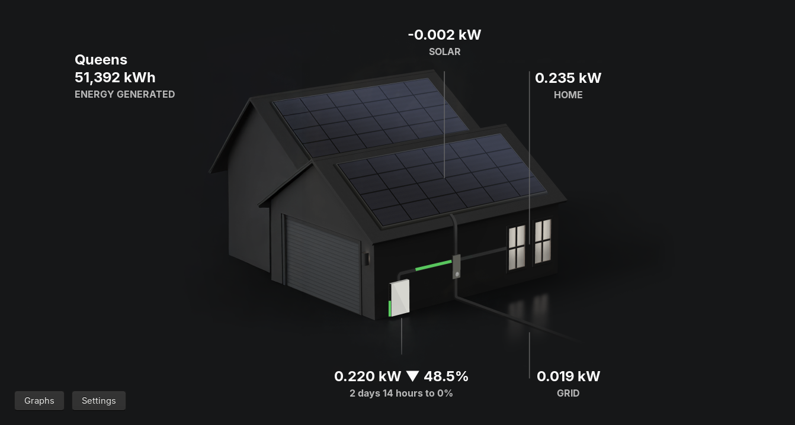

# Powerwall TV for Linux

GTK-based Linux desktop app for Powerwall TV.



Ported from [Powerwall-TV for tvOS](https://github.com/sighmon/Powerwall-TV) by [OpenClaw](https://github.com/openclaw/openclaw) using `gpt-5.3-codex`.

## Features

- Live solar, home, Powerwall, grid, battery percentage, and animated energy-flow display
- Local Gateway and Tesla Fleet API modes, with automatic token refresh and regional API selection
- Local and Fleet Wall Connector state and power, charging-vehicle battery data, and Cybertruck scene selection
- Multi-site Fleet navigation, Storm Watch, intentional off-grid/grid-down states, battery count, reserve-aware runtime estimates, firmware, and install date
- Electricity Maps carbon intensity and renewable percentage
- Fleet calendar-history graphs for Powerwall, solar, home, grid, and state of energy, with daily navigation and source-aware colors
- Beta scheduler for Self-Powered, Time-Based Control, Off-Grid, and On-Grid transitions
- Optional menu-bar/status icon with selectable live metrics, plus keep-above and screen-saver inhibition options
- Demo mode by setting the Local Gateway IP to `demo`

The scene uses the same resize-aware positioning model as the source app. Its natural size is 1280×720: larger windows scale the scene and typography uniformly, while smaller windows crop the natural scene and detach the home summary so it remains accessible. Settings provide 80–120% scene scale and ±20% horizontal/vertical offsets.

Keyboard controls:

- `Up` / `Down`: change Fleet site on the dashboard or graph type in Graphs
- `Left` / `Right`: move between graph days
- `Esc`: leave Graphs or exit full screen

## Requirements

- Go (with CGO enabled)
- GTK3 development libraries (gotk3)
- Linux desktop session (X11/Wayland)

## Run

```bash
make dev
```

or:

```bash
go run ./cmd/powerwall-tv
```

During a side-by-side source checkout, scene images are found automatically in `../powerwall-tv/Powerwall-TV/Images`. Otherwise set `POWERWALL_TV_IMAGES_DIR` to that image directory. Flatpak builds fetch the five source images from a pinned source commit and verify their checksums.

Fleet OAuth uses the source app's `powerwalltv://app/callback` URI. The Flatpak desktop entry registers this handler. Set `TESLA_CLIENT_ID` and `TESLA_CLIENT_SECRET`, or paste an access token in Settings.

## Build

```bash
make build
```

Binary output:

- `bin/powerwall-tv`

## Vendoring and gotk3 patch

This repo tracks `vendor/` in git.

To refresh vendored dependencies and apply the gotk3 compatibility patch:

```bash
make vendor
```

This runs:

1. `go mod vendor`
2. `./scripts/patch-gotk3.sh`

## Flatpak

```bash
make flatpak
```

Quick iterative build:

```bash
make flatpak-fast
```

Run installed flatpak:

```bash
make flatpak-run
```

## Notes

- Uses GTK3 via gotk3
- Secrets/tokens stored via go-keyring
- Vehicle charge snapshots are cached for up to one hour in the user configuration directory
